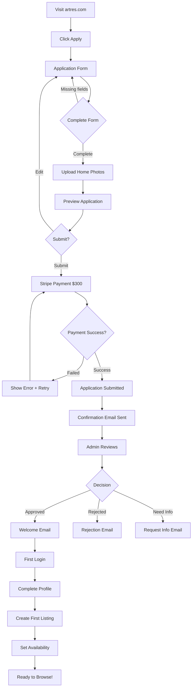
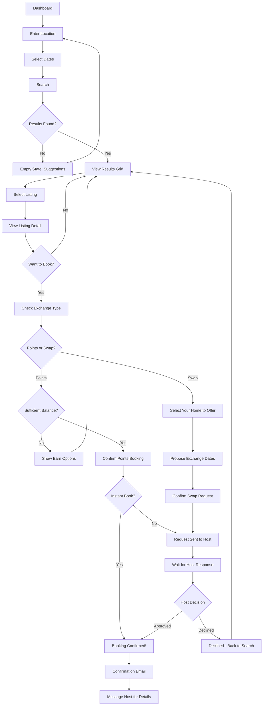
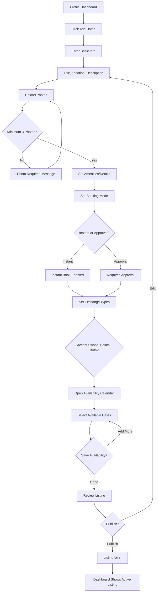
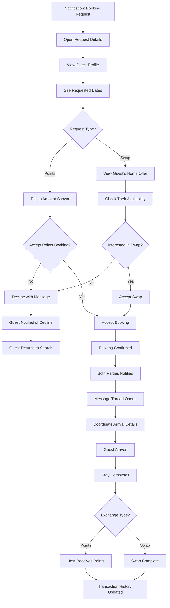
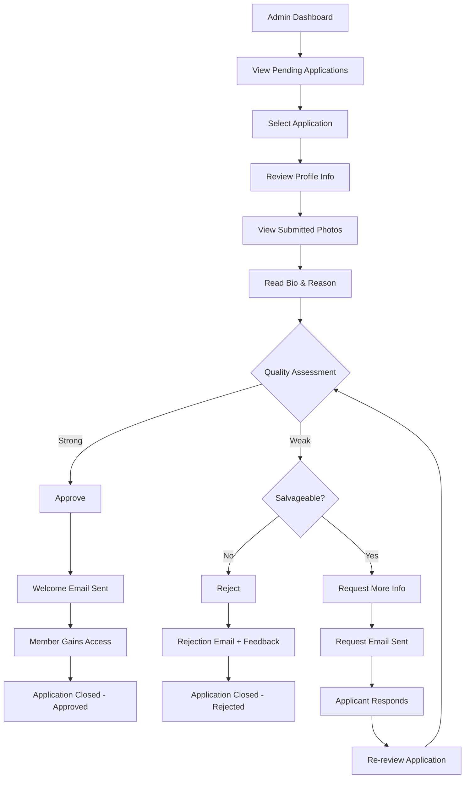

# UX Design Specification - home-swap-mvp

**Author:** Art Res
**Date:** 2026-01-17

---

## Executive Summary

### Project Vision

Art Res is a membership-based home exchange platform that combines Airbnb's booking simplicity, HomeExchange's reciprocal model, and Soho House's curated community. The platform serves creative remote workers, artists, and patrons who value authentic travel experiences within a trusted community.

**Core UX Principle:** Trust through curation eliminates the need for extensive pre-booking messaging. Members can select dates and book directly because every member has been personally vetted.

### Target Users

**Primary Personas:**

1. **Home Exchangers (Maya & Daniel)** - Remote workers with multiple homes seeking friction-free exchanges
2. **Travelers (James)** - Location-flexible professionals wanting affordable longer stays
3. **Artists (Sofia)** - Creatives seeking residency-style experiences on limited budgets
4. **Hosts/Patrons (Richard)** - Community-minded individuals who want to host interesting people

**Shared Traits:** Culture-curious, experience-seeking, value authenticity over tourist experiences, appreciate well-designed spaces.

### Key Design Challenges

1. **Trust Without Conversation** - Design must convey member quality and trustworthiness visually
2. **Booking Mode Clarity** - Two booking modes (instant/approval) and two exchange types (swap/points) must be intuitive
3. **Multi-Property Calendar Management** - Hosts with multiple homes need efficient availability management
4. **Mobile Calendar Experience** - Date selection and availability viewing on small screens
5. **New Member Onboarding** - Points system and exchange mechanics must be immediately understood

### Design Opportunities

1. **Simplicity Advantage** - Fewer options than competitors means faster, more confident decisions
2. **Community Warmth** - Profile and listing design that feels personal, not commercial
3. **Visual Availability** - Calendar design that makes booking decisions obvious
4. **Transparent Points Economy** - Earning and spending that feels rewarding and fair
5. **Conversational Messaging** - Real-time coordination that feels like texting friends

---

## Core User Experience

### Defining Experience

**Primary User Action:** Search for available homes by location and dates, then book directly without negotiation.

**Core Value Delivery:** The moment a user finds an available home and books it in under a minute—experiencing the trust and ease that differentiates Art Res from HomeExchange's messaging friction and Airbnb's transactional nature.

**Core Loop:**
1. **Host** → Earn points by welcoming guests
2. **Search** → Find homes matching your travel dates
3. **Book** → Instant or request approval
4. **Stay** → Experience the community
5. **Repeat** → Use earned points for next trip

### Platform Strategy

**Primary Platform:** Progressive Web Application (mobile-responsive SPA)

| Aspect | Decision | Rationale |
|--------|----------|-----------|
| **Touch-First** | Yes | Mobile browsing during travel planning |
| **Desktop Support** | Full | Detailed listing creation and calendar management |
| **Offline** | No | Real-time availability critical |
| **Future Mobile** | Designed for transition | Stateless API architecture |

**Responsive Priorities:**
1. Mobile (320-767px): Search, browse, book, message
2. Desktop (1024px+): List homes, manage calendars, review applications

### Effortless Interactions

**Zero-Friction Targets:**

| Interaction | Target State |
|-------------|-------------|
| Find available homes | Enter location + dates → see only bookable homes |
| Book a stay | Select dates → one tap to confirm (instant book) |
| Check points | Always visible in header/profile |
| Approve a request | Notification → review profile → approve in one tap |
| Message a member | Tap → type → send (no formal structure) |

**Eliminate Competitor Pain Points:**
- No message-before-booking requirement (HomeExchange friction)
- No price negotiation (Airbnb haggling)
- No complex filters (Airbnb overwhelm)

### Critical Success Moments

**Make-or-Break Interactions:**

| Moment | Success Indicator | Failure Mode |
|--------|-------------------|--------------|
| **First search** | 3+ available homes shown | "Nothing available" empty state |
| **First booking** | Confirmed in <60 seconds | Confusion about swap vs. points |
| **First hosting** | Points credited immediately | Unclear when/how points awarded |
| **First points use** | Clear balance, easy redemption | "Not enough points" surprise |
| **Application review** | Decision in <2 minutes | Overwhelming applicant details |

**First-Time User Success Path:**
1. Apply → Get approved (feel selected, not processed)
2. List home → Set availability (feel in control)
3. Browse homes → See availability (feel possibility)
4. Book first stay → Confirm instantly (feel trust)

### Experience Principles

1. **Trust is Designed** - Visual curation and profile quality convey community trust without requiring conversation
2. **Availability is Obvious** - If you can see it, you can book it—no hidden unavailability
3. **Points are Transparent** - Always know your balance, always understand the exchange
4. **Booking is Instant** - The goal is one-tap confirmation, not endless coordination
5. **Community Over Commerce** - Every interaction should feel personal, not transactional

---

## Desired Emotional Response

### Primary Emotional Goals

**Core Emotion:** Belonging to a trusted community of like-minded creative travelers.

| Emotion | Target Experience | Design Driver |
|---------|-------------------|---------------|
| **Belonging** | "I'm part of something special, not just a customer" | Community-first messaging, member profiles that feel personal |
| **Trust** | "I can trust these people with my home" | Curated membership, visible vetting, quality imagery |
| **Ease** | "That was remarkably simple" | One-tap booking, no negotiation required |
| **Delight** | "This exceeded my expectations" | Thoughtful details, community warmth |

**Anti-Goal:** Users should never feel like they're using a generic rental platform.

### Emotional Journey Mapping

| Journey Stage | Target Emotion | Experience Goal |
|--------------|----------------|-----------------|
| **Discovery** | Intrigued | "This sounds different from everything else" |
| **Application** | Valued | "They want to know who I am, not just my credit card" |
| **Approval** | Welcomed | "I was selected to join" (not just processed) |
| **Onboarding** | Empowered | "I understand how this works" |
| **Browsing** | Excited | "Look at all these amazing places" |
| **Booking** | Confident | "I know exactly what I'm getting" |
| **Pre-Stay** | Anticipation | "I can't wait to experience this" |
| **Stay** | Connected | "This is nothing like a transactional rental" |
| **Post-Stay** | Grateful | "I want to do this again" |
| **Hosting** | Generous | "I'm contributing to the community" |

### Micro-Emotions

**Cultivate These:**
- **Confidence** over confusion (clear UI, obvious next steps)
- **Trust** over skepticism (visible curation, quality imagery)
- **Belonging** over isolation (community language, personal profiles)
- **Accomplishment** over frustration (instant feedback, easy wins)

**Prevent These:**
- Anxiety about host reliability → Trust signals in profiles
- Confusion about points/swaps → Always-visible balances, clear explanations
- Feeling "processed" → Personalized touches, human approval
- Fear of the unknown → Detailed listings, real member photos

### Design Implications

| Emotional Goal | UX Design Approach |
|----------------|-------------------|
| **Trust** | High-quality member photos, detailed bios, visible community standards |
| **Ease** | Minimal steps to book, no required messaging, one-tap approvals |
| **Belonging** | Warm copy, first names, community-focused language |
| **Delight** | Thoughtful microinteractions, celebratory booking confirmations |
| **Confidence** | Always-visible points balance, clear availability states |

### Emotional Design Principles

1. **Welcome, Don't Process** - Every touchpoint should feel like joining a community, not creating an account
2. **Show Trust, Don't Claim It** - Real photos, real bios, real homes—let quality speak
3. **Celebrate Moments** - First booking, first hosting, earning points are achievements worth acknowledging
4. **Humanize Errors** - When things go wrong, respond with warmth, not corporate speak
5. **Anticipate Anxiety** - Address worries before users have them (availability, host reliability, points value)

---

## UX Pattern Analysis & Inspiration

### Inspiring Products Analysis

**Primary Inspiration Sources** (from PRD positioning):

#### Airbnb: Booking Simplicity
- **Adopt:** Visual search with date filtering, high-quality listing imagery, one-tap booking flow, mobile-first touch interactions
- **Avoid:** Hidden fees, overwhelming filters, transactional coldness, generic commercial feel

#### HomeExchange: Reciprocal Value
- **Adopt:** Points-based flexibility, detailed member profiles that build trust
- **Avoid:** Message-heavy booking process (core problem we solve), complicated negotiations, slow UX

#### Soho House: Curated Community
- **Adopt:** Application-based membership creating quality signal, "inside the velvet rope" belonging, warm sophisticated aesthetic, human touch in approval
- **Avoid:** Pretentiousness, inaccessibility, over-designed complexity

#### Supporting Inspirations
| Product | Pattern | Application |
|---------|---------|-------------|
| iMessage | Real-time casual messaging | Member chat experience |
| Cal.com | Clean calendar UI | Availability management |
| Stripe | Seamless checkout | Membership payment |
| Notion | Warm minimal design | Overall aesthetic |

### Transferable UX Patterns

**Navigation Patterns:**
- Bottom tab bar for mobile (Airbnb) → Home, Search, Bookings, Messages, Profile
- Sticky search bar with date filters → Persistent availability filtering

**Interaction Patterns:**
- Photo carousel with dots (Airbnb) → Listing galleries
- Pull-to-refresh (iOS standard) → Messages, search results
- Swipe to dismiss (iOS standard) → Modals and sheets
- Calendar date range picker (Cal.com) → Availability selection

**Trust Patterns:**
- Member since badge (Airbnb) → Community tenure visibility
- Response rate/time (Airbnb) → Host responsiveness signal
- Verified identity indicators → Trust without extensive messaging

**Booking Patterns:**
- Instant book vs. request (Airbnb) → Direct adoption with swap/points variation
- Clear confirmation screens → Booking success celebration
- Countdown timers for pending requests → Urgency without pressure

### Anti-Patterns to Avoid

| Anti-Pattern | Source | Why Avoid |
|--------------|--------|-----------|
| **Message-before-book** | HomeExchange | Core friction we're eliminating |
| **Hidden fees revealed late** | Airbnb | Erodes trust at critical moment |
| **Overwhelming filter options** | Airbnb | Contradicts simplicity goal |
| **Complex negotiation flows** | HomeExchange | Slows booking to a crawl |
| **Cold transactional copy** | Most rentals | Conflicts with community warmth |
| **Tiny calendar interactions** | Many booking sites | Fails mobile-first requirement |
| **Generic success messages** | Most apps | Misses celebration opportunity |

### Design Inspiration Strategy

**Adopt Directly:**
- Airbnb's visual search and listing presentation
- Soho House's application-based membership flow
- iMessage's casual, real-time chat interface
- Stripe's seamless payment completion

**Adapt for Art Res:**
- HomeExchange points system → Simpler, always-visible balance
- Airbnb instant book → Two modes (instant + approval) with swap/points
- Soho House exclusivity → Warmth over pretension

**Innovate Beyond:**
- No message-before-booking requirement (our key differentiator)
- Points balance always visible in header
- Celebration moments for first booking, first hosting
- Community-first language throughout

**Avoid Entirely:**
- Any pattern requiring negotiation or back-and-forth
- Hidden information revealed late in flows
- Cold, transactional, corporate language
- Complex filter interfaces

---

## Design System Foundation

### Design System Choice

**Selected:** Tailwind CSS + shadcn/ui component library

**Philosophy:** Own your components with a utility-first approach. Maximum flexibility, minimal vendor lock-in, excellent developer experience for small teams.

### Rationale for Selection

| Factor | Decision Driver |
|--------|-----------------|
| **Team Size (1-2 devs)** | shadcn/ui components are copy-paste, not npm dependencies—easy to understand and modify |
| **Timeline (8-12 weeks)** | Pre-built components for forms, calendars, modals accelerate MVP development |
| **Brand Warmth** | Tailwind allows complete visual customization; not locked into Material's corporate aesthetic |
| **Mobile-First** | Tailwind's responsive utilities (`sm:`, `md:`, `lg:`) are industry-leading |
| **Accessibility** | shadcn/ui built on Radix UI primitives—WCAG 2.1 AA compliant out of the box |
| **Future Flexibility** | Components live in your codebase; no breaking changes from external libraries |

### Implementation Approach

**Setup:**
1. Initialize Tailwind CSS with custom configuration
2. Install shadcn/ui CLI and add components as needed
3. Define design tokens in `tailwind.config.js`
4. Create component variants for Art Res brand

**Component Strategy:**
- **Use shadcn/ui directly:** Button, Input, Dialog, Card, Calendar, Avatar
- **Extend/customize:** Navigation tabs, listing cards, chat messages
- **Build custom:** Points balance display, availability calendar overlay, booking flow

### Customization Strategy

**Design Tokens (tailwind.config.js):**

| Token Category | Customization |
|----------------|---------------|
| **Colors** | Warm palette: soft whites, warm grays, accent colors reflecting art/creativity |
| **Typography** | Clean sans-serif (Inter or similar), generous line heights for readability |
| **Spacing** | Comfortable spacing that feels premium, not cramped |
| **Borders** | Subtle rounded corners (like Notion), no harsh edges |
| **Shadows** | Soft, diffused shadows for warmth over stark drop shadows |

**Component Customization:**
- Cards: Larger imagery, warmer backgrounds, rounded corners
- Buttons: Primary CTAs in accent color, generous padding
- Forms: Clear labels, helpful microcopy, spacious inputs
- Calendar: Touch-friendly date cells, clear availability states

### Component Library Priorities

**MVP Critical (build first):**
1. Listing Card (home display)
2. Availability Calendar (date selection)
3. Booking Modal (confirmation flow)
4. Chat Message (messaging UI)
5. Member Profile Card (trust display)

**MVP Standard (use shadcn/ui defaults):**
- Form inputs, buttons, dialogs
- Navigation components
- Avatar, badge, tooltip

---

## Defining User Experience

### The Defining Interaction

**Core Experience:** "Find a home, pick your dates, book—no messages required."

**User Description:** "It's like Airbnb meets HomeExchange, but you just pick dates and book. No endless back-and-forth."

**Why This Defines Art Res:**
- Eliminates HomeExchange's core friction (15 messages → 2 responses)
- Maintains exchange value (no Airbnb fees)
- Trust through curation, not conversation

### User Mental Model

**What Users Bring:**
- Airbnb experience: "Browse → like → book"
- HomeExchange frustration: "Why won't anyone respond?"
- Soho House expectation: "Everyone here is vetted"

**Art Res Mental Model:**
- "If I can see it, I can book it"
- "Everyone's been approved, so I can trust them"
- "Points let me stay without a direct swap"

**Mental Model Risks:**
- Users may expect messaging-first (HomeExchange habit)
- Users may not understand points initially
- Users may wonder "why can I just book?"

**Design Response:**
- Clear onboarding explaining the curation model
- Points balance always visible
- "Why no messages?" explanation in UI

### Success Criteria

| Success Metric | Target | Failure State |
|----------------|--------|---------------|
| **Find to Book** | <90 seconds total | Browsing without booking |
| **Booking Confidence** | "I know exactly what I'm getting" | "Wait, what did I book?" |
| **Points Clarity** | Understood in first session | "How do points work?" confusion |
| **Trust Feeling** | "I trust this community" | "Is this person legit?" anxiety |

### Novel UX Patterns

**Innovation: Trust Through Curation**

Unlike any competitor, Art Res eliminates pre-booking communication by:
1. Vetting every member before they join
2. Showing quality through profile and listing design
3. Making approval the trust signal, not messages

**User Education Needed:**
- Explain curation model during onboarding
- Show "Why no messages needed" in booking flow
- Display member-since and approval status

**Innovation: Hybrid Booking Types**

Two booking modes on same listings:
1. **Points Exchange** - Spend points, no reciprocal required
2. **Direct Swap** - Offer your home for theirs (non-simultaneous OK)

**Design Challenge:** Make both options clear without overwhelming.

### Experience Mechanics

**1. Initiation: Search**
- User enters location + travel dates
- System filters to ONLY available homes
- No "request to book" uncertainty

**2. Interaction: Browse & Select**
- Scan listing cards (photo, location, host)
- Tap to view full listing
- See clear availability calendar
- Check points balance or offer swap

**3. Feedback: Booking Flow**
- Select dates (already know they're available)
- Choose: Points OR Swap offer
- See confirmation preview
- One tap to confirm (instant book) OR submit request (pending)

**4. Completion: Confirmation**
- Celebratory confirmation screen
- Clear next steps (message host optional)
- Calendar invite / save option
- Points deducted or swap confirmed

**Edge Cases:**
- Insufficient points → Show earn options, not dead end
- Pending approval → Clear status, expected response time
- Conflict during booking → Real-time availability check

---

## Visual Design Foundation

### Color System

**Brand Colors:**

| Role | Hex | Name | Usage |
|------|-----|------|-------|
| **Primary** | `#2C5545` | Forest | Main CTAs, active states, links |
| **Primary Light** | `#4A7A66` | Sage | Hover states, secondary actions |
| **Accent** | `#C4A77D` | Gold | Highlights, celebrations, premium elements |
| **Background** | `#FAFAF9` | Warm White | Page backgrounds |
| **Surface** | `#FFFFFF` | White | Cards, modals, elevated content |

**Semantic Colors:**

| Purpose | Hex | Usage |
|---------|-----|-------|
| Success | `#22C55E` | Booking confirmed, points earned |
| Warning | `#F59E0B` | Pending states, attention needed |
| Error | `#EF4444` | Validation errors, failures |
| Info | `#3B82F6` | Informational messages |

**Neutrals:**

| Level | Hex | Usage |
|-------|-----|-------|
| Text Primary | `#1C1917` | Headlines, important content |
| Text Secondary | `#57534E` | Body copy, descriptions |
| Text Muted | `#A8A29E` | Placeholders, captions |
| Border | `#E7E5E4` | Dividers, input borders |
| Muted BG | `#F5F5F4` | Secondary backgrounds |

**Color Psychology:**
- Forest green conveys growth, trust, and sophistication
- Warm gold adds warmth and celebrates achievements
- Warm whites feel inviting, not sterile

### Typography System

**Font Stack:**
```css
font-family: 'Inter', -apple-system, BlinkMacSystemFont, 'Segoe UI', Roboto, sans-serif;
```

**Type Scale:**

| Level | Size | Weight | Line Height | Letter Spacing |
|-------|------|--------|-------------|----------------|
| Display | 36px / 2.25rem | 600 | 1.2 | -0.02em |
| H1 | 30px / 1.875rem | 600 | 1.25 | -0.01em |
| H2 | 24px / 1.5rem | 600 | 1.3 | 0 |
| H3 | 20px / 1.25rem | 500 | 1.4 | 0 |
| Body | 16px / 1rem | 400 | 1.5 | 0 |
| Small | 14px / 0.875rem | 400 | 1.5 | 0 |
| Caption | 12px / 0.75rem | 400 | 1.4 | 0.01em |

**Typography Principles:**
- Headlines use semibold for visual hierarchy
- Body text optimized for extended reading
- Generous line heights for scannability

### Spacing & Layout Foundation

**Spacing Scale (Tailwind-aligned):**

| Token | Value | CSS Variable |
|-------|-------|--------------|
| 1 | 4px | --space-1 |
| 2 | 8px | --space-2 |
| 3 | 12px | --space-3 |
| 4 | 16px | --space-4 |
| 6 | 24px | --space-6 |
| 8 | 32px | --space-8 |
| 12 | 48px | --space-12 |
| 16 | 64px | --space-16 |

**Layout Grid:**
- 12-column grid for desktop
- 4-column for tablet
- Single column for mobile
- Max content width: 1280px
- Gutter: 24px (desktop), 16px (mobile)

**Component Spacing:**
- Card padding: 16-24px
- Button padding: 12px 24px
- Input padding: 12px 16px
- Section margins: 48-64px

### Accessibility Considerations

**Color Contrast (WCAG 2.1 AA):**

| Combination | Ratio | Status |
|-------------|-------|--------|
| Primary on White | 7.2:1 | ✅ AAA |
| Text Primary on Background | 15.8:1 | ✅ AAA |
| Text Secondary on Background | 7.1:1 | ✅ AAA |
| Accent on Primary | 3.5:1 | ✅ AA (large text) |

**Accessible Design Principles:**
- Minimum 44px touch targets
- Focus states visible and distinct
- Color not sole indicator (icons + text)
- Reduced motion option respected

---

## Design Direction

### Design Directions Explored

**Three directions were considered based on the visual foundation and brand values:**

| Direction | Concept | Key Characteristics |
|-----------|---------|---------------------|
| **Elevated Minimal** | Gallery-inspired sophistication | High contrast, generous whitespace, typography-forward, image-dominant cards |
| **Warm Community** | Cozy, inviting, approachable | Rounded corners, soft shadows, warm color tints, friendly illustrations |
| **Modern Editorial** | Magazine-style storytelling | Bold typography, asymmetric layouts, strong visual hierarchy |

### Chosen Direction: "Warm Minimal"

**Hybrid approach:** Elevated Minimal foundation with Warm Community personality.

**Core Concept:** Gallery-quality presentation that feels inviting, not intimidating. Clean and sophisticated, but with warmth that conveys trust and community.

### Design Rationale

| Design Choice | Rationale |
|--------------|-----------|
| **Clean layouts** | Reduces cognitive load, aligns with "effortless booking" promise |
| **Warm accents** | Forest green + gold create sophistication without coldness |
| **Generous whitespace** | Premium feel appropriate for membership model |
| **Soft shadows** | Depth without harshness, welcoming aesthetic |
| **High-quality imagery** | Homes and members showcased beautifully |
| **Rounded corners (subtle)** | Friendly without being childish |

### Implementation Approach

**Screen Development Priority:**

| Phase | Screens | Focus |
|-------|---------|-------|
| **Phase 1** | Home/Search, Listing Detail, Booking Flow | Core booking experience |
| **Phase 2** | Profile, Messages, Dashboard | Member engagement |
| **Phase 3** | Calendar Management, Admin | Host/admin tools |

**Design Token Application:**
- Primary (Forest): CTAs, links, active states
- Accent (Gold): Celebrations, highlights, premium indicators
- Neutrals: Text hierarchy, borders, backgrounds
- Semantic: Success/warning/error states

---

## User Journey Flows

### Journey 1: Member Application & Onboarding

**Entry Point:** Marketing site → "Apply for Membership"



**Key Decisions:**
- Payment before review → Validates commitment, refundable if rejected
- Photos required in application → Quality signal for reviewers
- Guided onboarding → Ensures members list homes immediately

---

### Journey 2: Search & Book

**Entry Point:** Logged-in dashboard → Search bar



**Key Decisions:**
- Instant book vs. pending → Host controls per listing
- Points check before booking → No disappointment at checkout
- Swap proposal includes dates → Non-simultaneous exchanges work

---

### Journey 3: Create & Manage Listing

**Entry Point:** Profile → "Add Home" or "Manage Listings"



**Key Decisions:**
- Minimum photo requirement → Quality standard
- Booking mode per listing → Different homes, different rules
- Availability first → Can't book without dates

---

### Journey 4: Host Booking Management

**Entry Point:** Notification → "New Booking Request"



**Key Decisions:**
- Guest profile visible before decision → Trust building
- Swap requires viewing their home → Fair exchange evaluation
- Message thread auto-opens → Easy coordination

---

### Journey 5: Admin Application Review

**Entry Point:** Admin Dashboard → Pending Applications



**Key Decisions:**
- Three outcomes possible → Approve/Reject/Request Info
- Feedback with rejection → Respect for applicants
- Re-review after info → Second chances when warranted

---

### Journey Patterns

**Navigation Patterns:**
- Persistent bottom navigation (mobile) / top navigation (desktop)
- Breadcrumb trails for multi-step flows
- "Back to results" quick return from detail views

**Decision Patterns:**
- Binary choices presented as clear buttons (not dropdowns)
- Consequences shown before confirming (points deduction, swap terms)
- Reversible actions where possible (cancel booking, edit listing)

**Feedback Patterns:**
- Immediate visual confirmation on actions
- Toast notifications for background completions
- Email + in-app notification for important events
- Progress indicators for multi-step flows

**Error Recovery:**
- Inline validation with helpful messages
- Save draft capability for long forms
- "Try again" with context preserved
- Clear path back to previous state

---

### Flow Optimization Principles

| Principle | Application |
|-----------|-------------|
| **Minimize steps to value** | Search → 2 inputs → see homes; Book → 1 tap for instant book |
| **Show don't ask** | Display points balance always; show availability visually |
| **Progressive disclosure** | Basic search first, filters on demand |
| **Celebrate success** | Booking confirmed → celebration animation + clear next steps |
| **Graceful failure** | Insufficient points → show how to earn, not dead end |
| **Reduce cognitive load** | One decision per screen in mobile booking flow |

---

## Component Strategy

### Design System Components

**Using Tailwind CSS + shadcn/ui (Radix UI primitives)**

| Category | shadcn/ui Components | Art Res Usage |
|----------|---------------------|---------------|
| **Forms** | Input, Textarea, Select, Checkbox, Switch, Label, Form | Application, listing creation, search |
| **Overlays** | Dialog, Sheet, Popover, Dropdown Menu, Alert Dialog | Booking modal, filters, confirmations |
| **Feedback** | Toast, Alert, Progress, Skeleton | Notifications, loading states |
| **Navigation** | Tabs, Navigation Menu, Breadcrumb | Main nav, profile sections |
| **Data Display** | Card, Avatar, Badge, Table | Listings, profiles, admin |
| **Actions** | Button, Toggle, Toggle Group | All CTAs and interactions |
| **Date** | Calendar, Date Picker | Availability management |

**Customization Approach:**
- Apply Art Res design tokens via tailwind.config.js
- Forest green primary, warm gold accents
- Soft shadows, 12px border-radius
- 44px minimum touch targets

---

### Custom Components

#### Listing Card

**Purpose:** Display home listing in search results and browse views

**Anatomy:**
- Photo carousel (3:2 aspect ratio) with dot indicators
- Host avatar + name + location + member tenure
- Description snippet (2 lines max)
- Booking mode badge (Instant Book / Request)
- Availability indicator for selected dates

**States:** Default, Hover (elevated), Unavailable (grayed), Loading (skeleton)

**Variants:** Grid (square, compact), List (horizontal, detailed)

**Accessibility:** Carousel keyboard navigable, alt text required, semantic structure

---

#### Points Balance Display

**Purpose:** Show member's current points balance with context

**Anatomy:**
- Points icon + balance number
- Progress bar (optional)
- Earned/spent summary

**States:** Positive (green), Low balance (amber, <100), Insufficient (red with gap shown)

**Variants:** Compact (header: "✦ 1,250"), Detailed (profile context)

**Accessibility:** aria-label for balance, live region for updates

---

#### Availability Calendar

**Purpose:** Display and select available dates for booking

**Anatomy:**
- Month header with navigation
- Day grid with availability states
- Legend for visual indicators
- Selected range highlight

**States:** Available (selectable), Unavailable (grayed), Selected (accent fill), Today (outlined), Past (disabled)

**Interaction:** Click for start date, click again for end date, drag to select range (desktop)

**Accessibility:** Full keyboard navigation, aria-selected states, screen reader date announcements

---

#### Chat Message Bubble

**Purpose:** Display messages in conversation threads

**Anatomy:**
- Message content
- Timestamp
- Read/delivery status (sent messages)
- Sender context (received messages)

**States:** Sent (right, primary), Received (left, neutral), Sending (faded), Failed (error + retry)

**Variants:** Text, With attachment, System message (centered)

**Accessibility:** role="log", aria-live for new messages

---

#### Booking Request Card

**Purpose:** Display pending booking request for host review

**Anatomy:**
- Request header with notification badge
- Guest avatar + name + member tenure
- Requested dates + property + exchange type
- Message preview
- Action buttons (Approve/Decline)
- Expiration timer

**States:** Pending (action required), Expiring (warning), Approved (success), Declined (archived)

**Accessibility:** Focusable card, labeled actions, urgency via aria-live

---

#### Search Bar Component

**Purpose:** Combined location + date search entry point

**Anatomy:**
- Location field with autocomplete
- Date range picker
- Search button

**Behavior:** Location autocomplete dropdown, date picker opens calendar, mobile expands to full-screen

**States:** Collapsed, Expanded, Filled, Error

**Accessibility:** Combobox pattern, keyboard-accessible calendar

---

### Component Implementation Strategy

**Build Approach:**
1. Configure Tailwind with Art Res design tokens
2. Install shadcn/ui components as needed (copy-paste model)
3. Build custom components composing shadcn primitives
4. Style all components with Tailwind utilities only

**Consistency Rules:**
| Element | Standard |
|---------|----------|
| Touch targets | 44px minimum |
| Card corners | 12px border-radius |
| Shadows | Soft, diffused (shadow-md) |
| Primary buttons | Forest green fill |
| Secondary buttons | Forest green outline |
| Form spacing | 16px between fields |
| Error messages | Red text below field |

---

### Implementation Roadmap

**Phase 1 - Core Booking (MVP Critical):**

| Component | Priority | Blocks |
|-----------|----------|--------|
| Search Bar | P0 | Home page functionality |
| Listing Card | P0 | Search results display |
| Availability Calendar | P0 | Booking flow |
| Points Balance | P0 | Header + booking validation |

**Phase 2 - Member Experience:**

| Component | Priority | Blocks |
|-----------|----------|--------|
| Photo Gallery/Uploader | P1 | Listing creation |
| Chat Message Bubble | P1 | Messaging feature |
| Booking Request Card | P1 | Host management |

**Phase 3 - Admin & Polish:**

| Component | Priority | Blocks |
|-----------|----------|--------|
| Application Review Card | P2 | Admin dashboard |
| Transaction History | P2 | Points detail view |
| Notification Center | P2 | Real-time updates |

---

## UX Consistency Patterns

### Button Hierarchy

**Primary Actions:**
- **Visual:** Forest green (`#2C5545`) fill, white text, rounded-lg
- **Usage:** One per screen/section maximum. Main CTA.
- **Examples:** "Search Homes", "Confirm Booking", "Approve", "Submit Application"

**Secondary Actions:**
- **Visual:** Forest green outline, transparent background
- **Usage:** Alternative actions, less prominent
- **Examples:** "Save Draft", "View Profile", "Cancel"

**Tertiary/Ghost Actions:**
- **Visual:** Text only, forest green color, underline on hover
- **Usage:** Inline actions, navigation links
- **Examples:** "Learn more", "Edit", "View all"

**Destructive Actions:**
- **Visual:** Red (`#EF4444`) outline or fill depending on severity
- **Usage:** Delete, decline, cancel confirmed items
- **Examples:** "Decline Request", "Cancel Booking", "Delete Listing"

**Button States:**

| State | Visual Treatment |
|-------|------------------|
| Default | As defined above |
| Hover | Slight darken (5%), cursor pointer |
| Active/Pressed | Darken 10%, slight scale down |
| Disabled | 50% opacity, cursor not-allowed |
| Loading | Spinner replaces text, disabled interaction |

---

### Feedback Patterns

**Success:**
- **Visual:** Green (`#22C55E`) background tint, checkmark icon
- **Duration:** Toast auto-dismisses after 5 seconds
- **Example:** "✓ Booking confirmed! Check your email for details."

**Error:**
- **Visual:** Red (`#EF4444`) background tint, alert icon
- **Duration:** Persists until dismissed or corrected
- **Example:** "Payment failed. Please check your card details."

**Warning:**
- **Visual:** Amber (`#F59E0B`) background tint, warning icon
- **Duration:** Persists until acknowledged
- **Example:** "⚠ This request expires in 12 hours"

**Info:**
- **Visual:** Blue (`#3B82F6`) background tint, info icon
- **Duration:** Auto-dismiss after 5 seconds
- **Example:** "ℹ You can earn points by hosting members"

**Toast Positioning:**
- Mobile: Bottom center, above navigation
- Desktop: Top right corner
- Stack limit: 3 maximum

---

### Form Patterns

**Field Layout:**
- Label above input (required fields marked with *)
- Helper text below for guidance
- Error text replaces helper on validation failure

**Validation Timing:**
- Required/format: Validate on blur
- Cross-field: Validate on submit
- Real-time: Only for password strength, character counts

**Error Display:**
- Red border on invalid field
- Red error text below field
- Auto-focus first error on submit

**Multi-Step Forms:**
- Progress indicator at top
- "Back" always available
- Auto-save draft every 30 seconds

**Input Specifications:**

| Input Type | Height | Padding |
|------------|--------|---------|
| Text input | 44px | 12px 16px |
| Textarea | Auto (min 100px) | 12px 16px |
| Select | 44px | 12px 16px |

---

### Navigation Patterns

**Mobile (Bottom Tab Bar):**
- 5 tabs: Home, Search, Trips, Messages, Profile
- Active: Primary color, filled icon
- Badge: Red dot for unread items

**Desktop (Top Navigation):**
- Logo left, search center, actions right
- Profile dropdown for account actions
- Points balance always visible

**Back Navigation:**
- Left-positioned arrow
- Use browser history when possible
- Explicit "Cancel" for form abandonment

**Breadcrumbs (Desktop Only):**
- Show for detail pages and multi-step flows
- Clickable ancestors, current page plain text

---

### Modal & Overlay Patterns

**Modal Sizes:**
- Small (500px): Confirmations, simple forms
- Medium (700px): Booking flow, complex forms
- Large (900px): Full content, galleries

**Modal Rules:**
- Backdrop: Semi-transparent dark overlay
- Close: X button, click outside, Escape key
- Focus: Trap within modal, return on close

**Sheet (Mobile):**
- Slides up from bottom
- Drag handle for dismiss
- Max height: 90% viewport

---

### Empty States

**Structure:**
- Illustration (optional)
- Primary message (what's empty)
- Secondary explanation (why/what to do)
- Action button (how to fill it)

**Examples:**

| Context | Message | Action |
|---------|---------|--------|
| No search results | "No homes available for your dates" | "Try different dates" |
| No bookings | "You don't have any trips yet" | "Browse homes" |
| No messages | "No conversations yet" | "Find a home to book" |
| No listings | "You haven't listed a home" | "Add your first home" |

---

### Loading States

**Skeleton Loading:**
- Use for content cards, lists, profiles
- Match actual content layout
- Subtle pulse animation

**Spinner Loading:**
- Use for button actions, form submits
- Replace button text with spinner
- Disable interaction during load

**Timing Guidelines:**

| Duration | Treatment |
|----------|-----------|
| < 300ms | No indicator |
| 300ms - 2s | Spinner/skeleton |
| > 2s | Progress with message |

---

### Search & Filtering Patterns

**Search Flow:**
1. Enter location (autocomplete)
2. Select dates (calendar picker)
3. Submit → Results with count

**Filter Display:**
- Mobile: "Filters" button → bottom sheet
- Desktop: Dropdown or sidebar
- Active filters: Chips with clear (×)

**No Results:**
- Friendly message
- Suggest broadening search
- Quick clear actions

---

## Responsive Design & Accessibility

### Responsive Strategy

**Mobile-First Approach:**
Art Res is designed mobile-first—members browse and book during travel planning, often on phones. Desktop enhances the experience for detailed tasks like listing creation and calendar management.

**Device Priorities:**

| Device | Priority | Primary Use Cases |
|--------|----------|-------------------|
| **Mobile (320-767px)** | High | Search, browse, book, message |
| **Tablet (768-1023px)** | Medium | Extended browsing, casual management |
| **Desktop (1024px+)** | High | Listing creation, calendar, admin |

---

### Breakpoint Strategy

**Tailwind Breakpoints:**

| Breakpoint | Width | Layout Changes |
|------------|-------|----------------|
| `sm` | 640px | Increased padding, 2-column options |
| `md` | 768px | Tablet layout, side-by-side content |
| `lg` | 1024px | Desktop navigation, multi-column grids |
| `xl` | 1280px | Max content width, generous whitespace |

**Layout Adaptations:**

| Screen | Navigation | Content | Actions |
|--------|------------|---------|---------|
| **Mobile** | Bottom tabs | Single column | Full-width buttons |
| **Tablet** | Bottom/top tabs | 2-column grid | Inline buttons |
| **Desktop** | Top nav + sidebar | 3-4 column grid | Contextual buttons |

---

### Mobile-Specific Adaptations

- Fixed bottom tab bar (Home, Search, Trips, Messages, Profile)
- Full-screen search modal with date picker
- Single-column card list for results
- One step per screen in booking flow
- Sticky CTA buttons at bottom
- Swipe gestures for carousels

---

### Desktop Enhancements

- 3-4 column listing grids
- Persistent sidebar for filters
- Multi-column forms
- Hover states and tooltips
- Keyboard shortcuts
- Drag-and-drop for photo ordering

---

### Accessibility Strategy

**Target Level:** WCAG 2.1 Level AA

| Category | Requirement | Implementation |
|----------|-------------|----------------|
| **Perceivable** | Color contrast 4.5:1 | Verified in color system |
| **Perceivable** | Text alternatives | Alt text required for all photos |
| **Operable** | Keyboard navigable | Tab/Enter/Escape for all interactions |
| **Operable** | Touch targets 44px | Enforced in component specs |
| **Understandable** | Clear labels | Form patterns define this |
| **Robust** | Semantic HTML | Proper headings, landmarks |

---

### Color Accessibility

**Verified Contrast Ratios:**

| Combination | Ratio | Level |
|-------------|-------|-------|
| Primary on White | 7.2:1 | AAA |
| Text Primary on Background | 15.8:1 | AAA |
| Text Secondary on Background | 7.1:1 | AAA |

**Color Blindness:** Never use color alone—always pair with icons or text.

---

### Keyboard Navigation

**Focus Order:** Logical tab order following visual layout

**Key Bindings:**

| Key | Action |
|-----|--------|
| Tab | Next focusable element |
| Shift+Tab | Previous element |
| Enter/Space | Activate |
| Escape | Close modal/overlay |
| Arrows | Navigate calendars, menus |

**Focus Indicators:** 2px solid primary color ring, visible on all backgrounds

---

### Screen Reader Support

**Semantic Structure:**
- `<header>` for navigation
- `<main>` for primary content
- `<nav>` for navigation areas
- `<aside>` for filters/secondary

**ARIA Patterns:**

| Component | Implementation |
|-----------|----------------|
| Search | role="combobox", aria-expanded |
| Calendar | role="grid", aria-selected |
| Modal | role="dialog", aria-modal |
| Toast | role="alert", aria-live |

---

### Testing Strategy

**Responsive Testing:**
- Browser DevTools: Every PR
- Real devices (iPhone, Android, iPad): Weekly
- Cross-browser (BrowserStack): Before release

**Accessibility Testing:**
- Automated (axe, Lighthouse): Every PR
- Keyboard navigation: Every feature
- Screen reader (VoiceOver, NVDA): Weekly

**Accessibility Checklist:**
- [ ] Pages pass axe automated scan
- [ ] Full keyboard navigation works
- [ ] Screen reader announces content logically
- [ ] Color contrast meets AA
- [ ] Touch targets 44px minimum
- [ ] Focus indicators visible
